## COLOS
COLOS is a collection of high quality vim colorschemes.
### [Badwolf](http://github.com/sjl/badwolf)
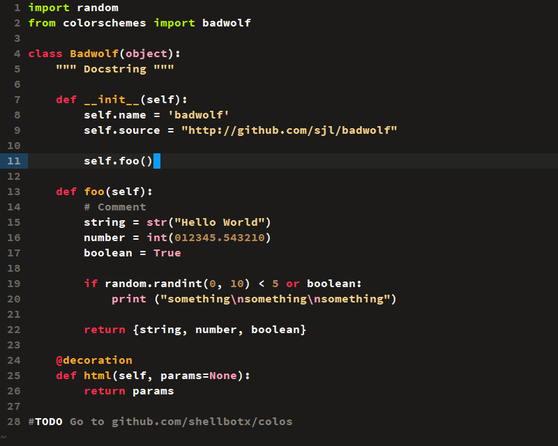

### [Blackboard](http://github.com/nelstrom/vim-blackboard)
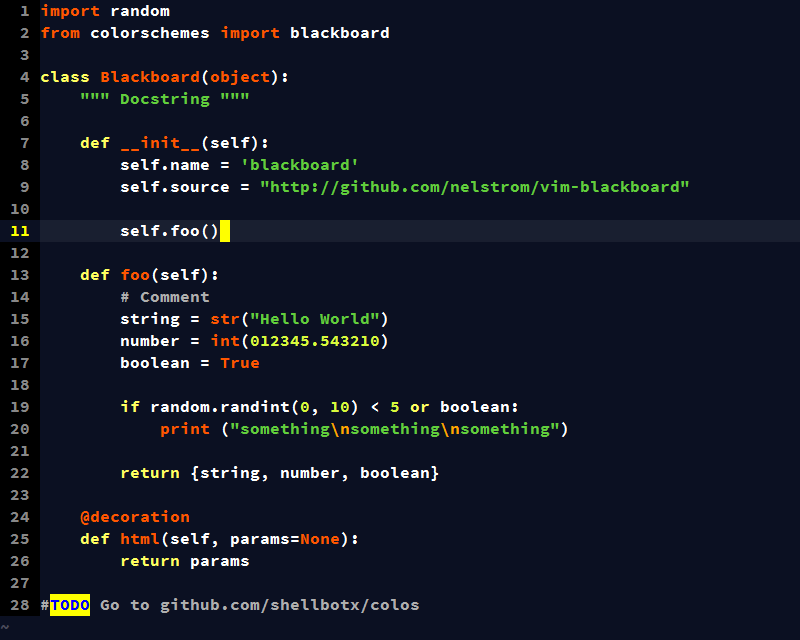

### [Cobalt2](http://github.com/herrbischoff/cobalt2.vim)

### [Dracula](http://github.com/zenorocha/dracula-theme)
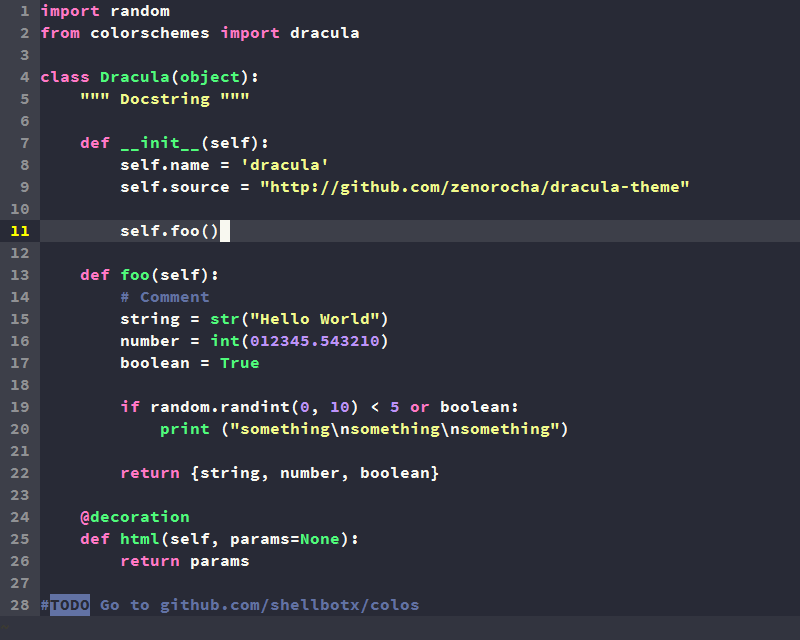

### [Flatlandia](http://github.com/jordwalke/flatlandia)
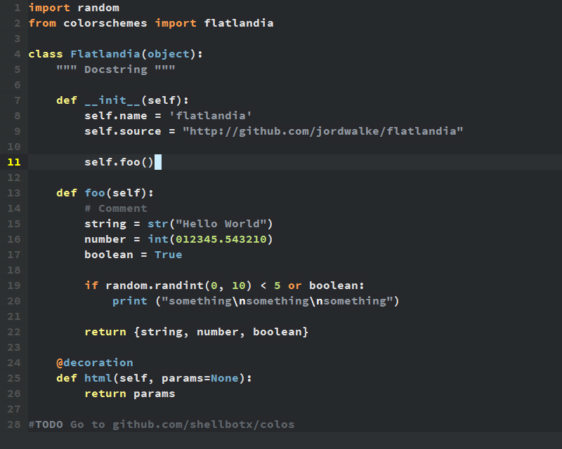

### [Gotham](http://github.com/whatyouhide/vim-gotham)
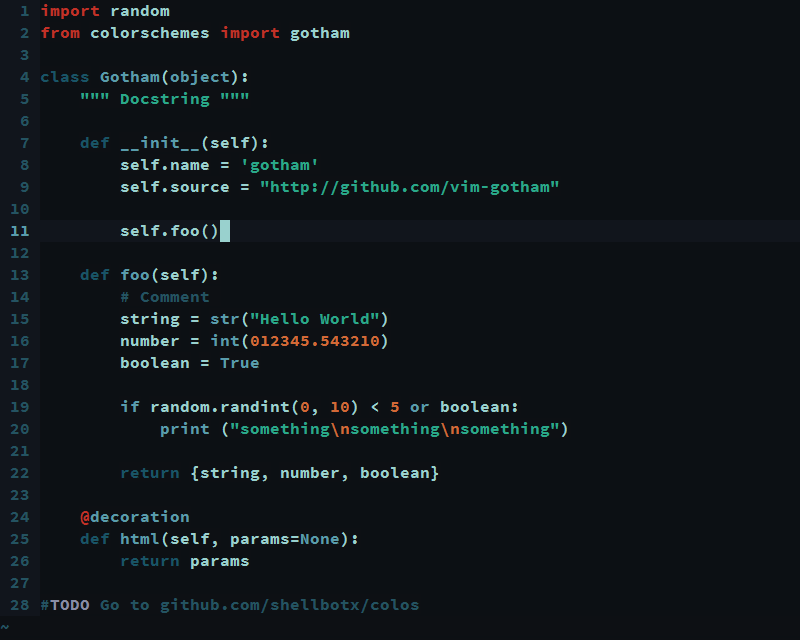

### [Gruvbox](http://github.com/morhetz/gruvbox)
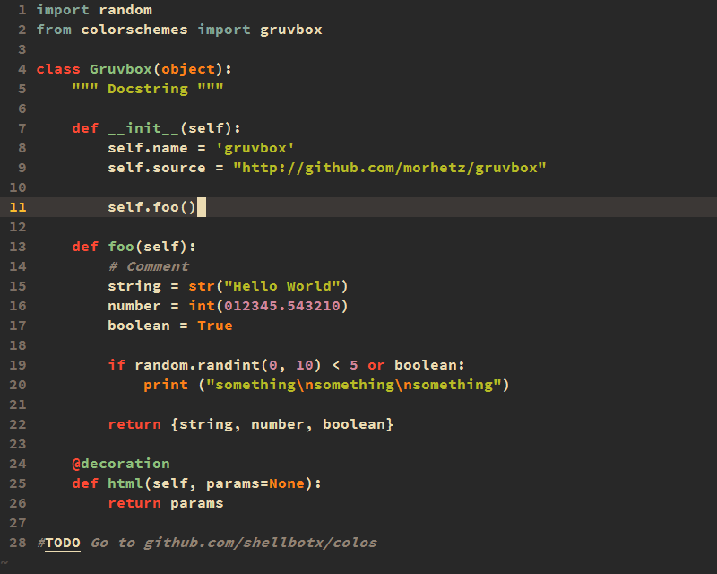

### [Molokai](http://github.com/tomasr/molokai)
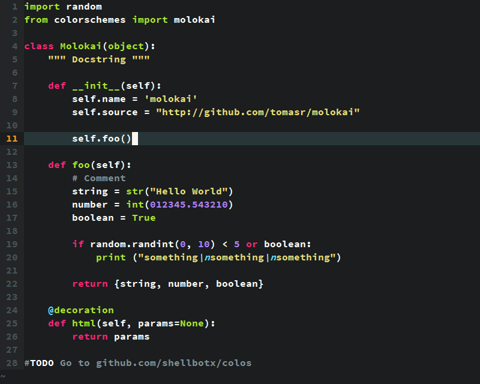

### [OceanicNext](http://github.com/mhartington/oceanic-next)
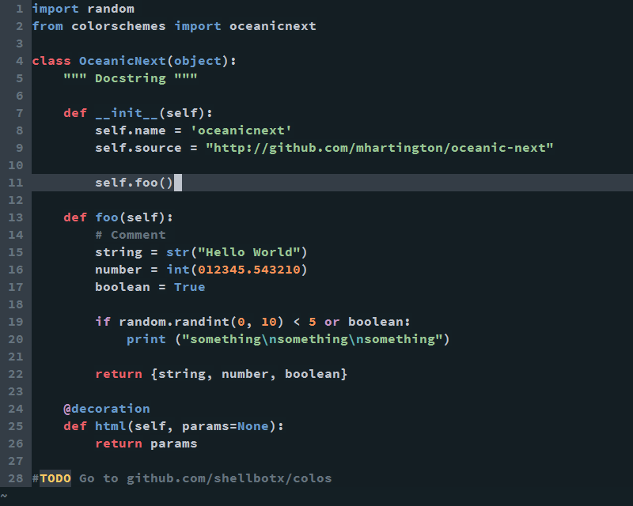

### [Pyte](http://github.com/vim-scripts/pyte)
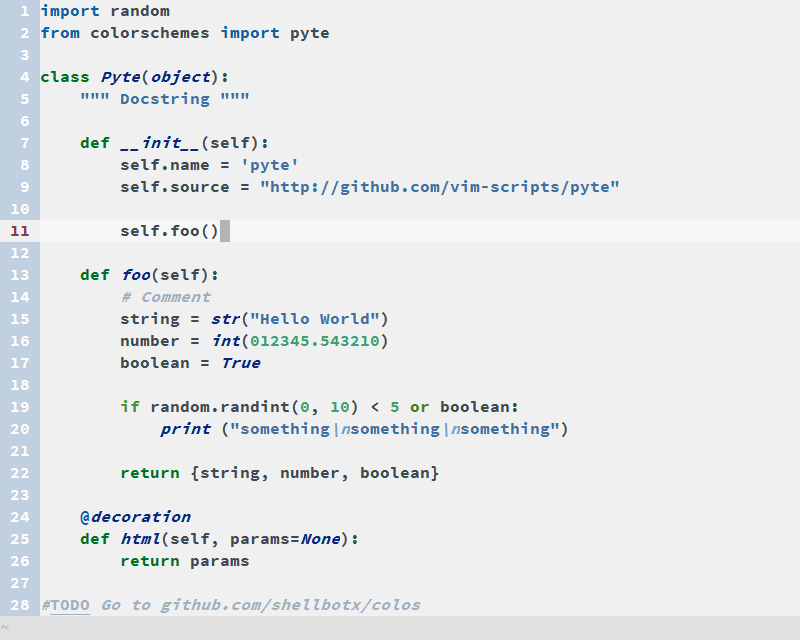

### [Railscasts](http://github.com/jpo/vim-railscasts-theme)
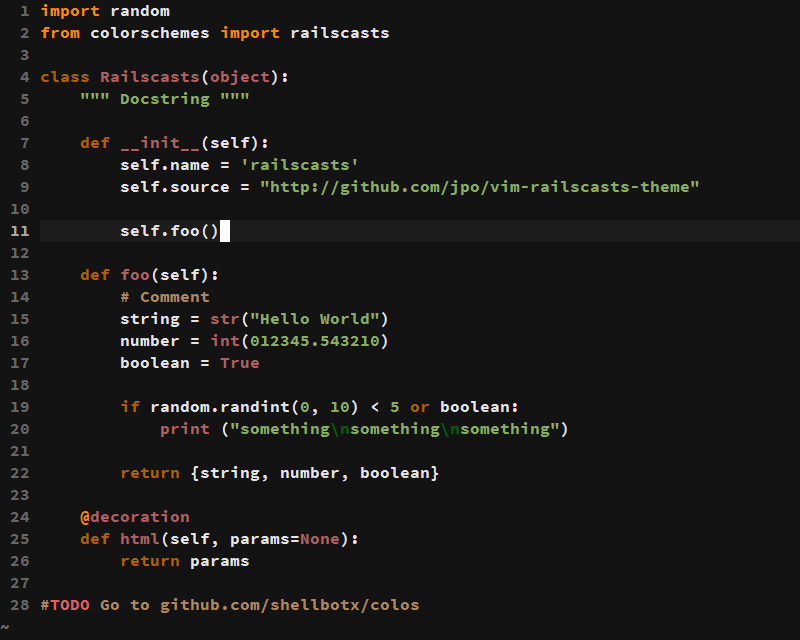

### [Solarized](http://github.com/altercation/vim-colors-solarized)
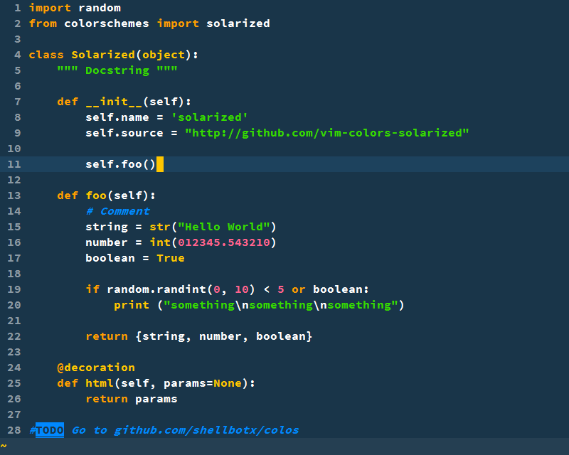

### [Summerfruit256](http://github.com/vim-scripts/summerfruit256.vim)
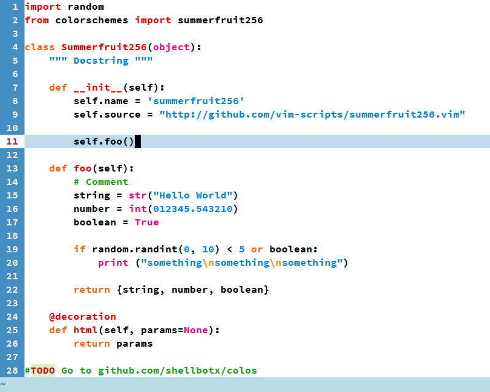

_Font: SourceCodePro 12 bold_